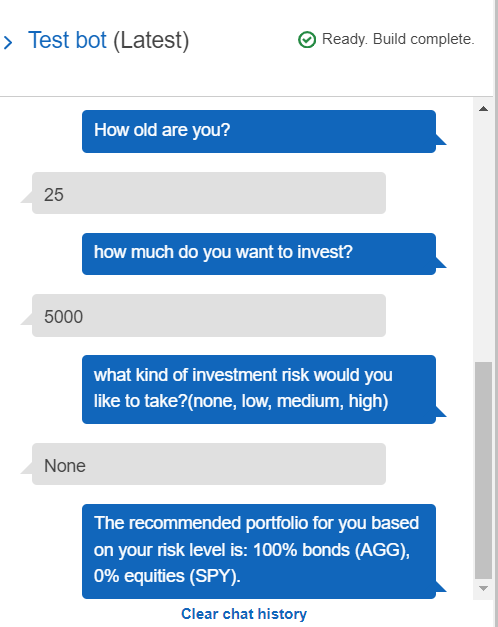

# robo-advisor

## Description
An AWS-built investment advisor bot is an artificial intelligence tool that provides personalized investment recommendations to users based on various data inputs, including their age, and risk tolerance. This bot leverages the power of machine learning algorithms and natural language processing techniques to analyze vast amounts of financial data and make informed investment decisions. The bot can interact with users through a user-friendly interface, such as a chatbot, and can be integrated into existing financial applications. This project uses AWS Lex and Lambda. The Lex Bot uses Lambda to check against constraints.

The criteria for the bot is seen below:

- Bot name: RoboAdvisor
- Language: English (US)
- Output voice: Salli
- Session timeout: 5 Minutes
- Sentiment analysis: No
- COPPA: No
- Advanced Options: No
- All other options: Default values

Our intents are defined below:

- Utterances

    - I want to save money for my retirement
    - I'm {age} and I would like to invest for my retirement
    - I'm ​{age} and I want to invest for my retirement
    - I want the best option to invest for my retirement
    - I'm worried about my retirement
    - I want to invest for my retirement
    - I would like to invest for my retirement

- Slots

    - firstName (AMAZON.US_FIRST_NAME)
    - age (AMAZON.NUMBER)
    - investmentAmount (AMAZON.NUMBER)
    - riskLevel (AMAZON.AlphaNumeric)

Once everything has been defined, we can test our bot using Lex. As the picture shows below:

## Table of Contents

- [Robo Advisor](#robo-advisor)
    - [Description](#description)
    - [Table of Contents](#table-of-contents)
    - [1. Installation](#1-installation)
    - [2. Usage](#2-usage)
    - [3. License](#3-license)
    - [4. Contributing](#4-contributing)
    - [5. Tests](#5-tests)
    - [6. Deployment](#6-deployment)
    - [7. Contact](#7-contact)

## 1. Installation

If you would like to clone the repository, type "git clone https://github.com/arianamoreno13/robo-advisor.git". In your terminal, with the conda dev environment activated. This allows you to save the code needed to make the constraints. 

The following is used in this repository:

- AWS Lex (V1) - NLP Chatbot
- AWS Lambda - Business logic extension to Lex bot

## 2. Usage

After cloning the repository locally, you'll need to have the packages listed in Installation installed on your machine.

## 3. License
    MIT License
Copyright (c) 2023 Ariana Moreno

Permission is hereby granted, free of charge, to any person obtaining a copy of this software and associated documentation files (the "Software"), to deal in the Software without restriction, including without limitation the rights to use, copy, modify, merge, publish, distribute, sublicense, and/or sell copies of the Software, and to permit persons to whom the Software is furnished to do so, subject to the following conditions:

The above copyright notice and this permission notice shall be included in all copies or substantial portions of the Software.

THE SOFTWARE IS PROVIDED "AS IS", WITHOUT WARRANTY OF ANY KIND, EXPRESS OR IMPLIED, INCLUDING BUT NOT LIMITED TO THE WARRANTIES OF MERCHANTABILITY, FITNESS FOR A PARTICULAR PURPOSE AND NONINFRINGEMENT. IN NO EVENT SHALL THE AUTHORS OR COPYRIGHT HOLDERS BE LIABLE FOR ANY CLAIM, DAMAGES OR OTHER LIABILITY, WHETHER IN AN ACTION OF CONTRACT, TORT OR OTHERWISE, ARISING FROM, OUT OF OR IN CONNECTION WITH THE SOFTWARE OR THE USE OR OTHER DEALINGS IN THE SOFTWARE.

## 4. Contributing

[Ariana Moreno](https://github.com/arianamoreno13)

## 5. Tests

- There are four tests associated with this repository. They can be found in the "Test_Events" directory.
    - ageError
    - correctDialog
    - incorrectAmountError
    - negativeAgeError

## 6. Deployment

There is currently no live deployment of this notebook on a common server, but it can be configured using AWS Lex and Lambda.

## 7. Contact

- [Ariana's Linkedin](www.linkedin.com/in/arianapmoreno)

